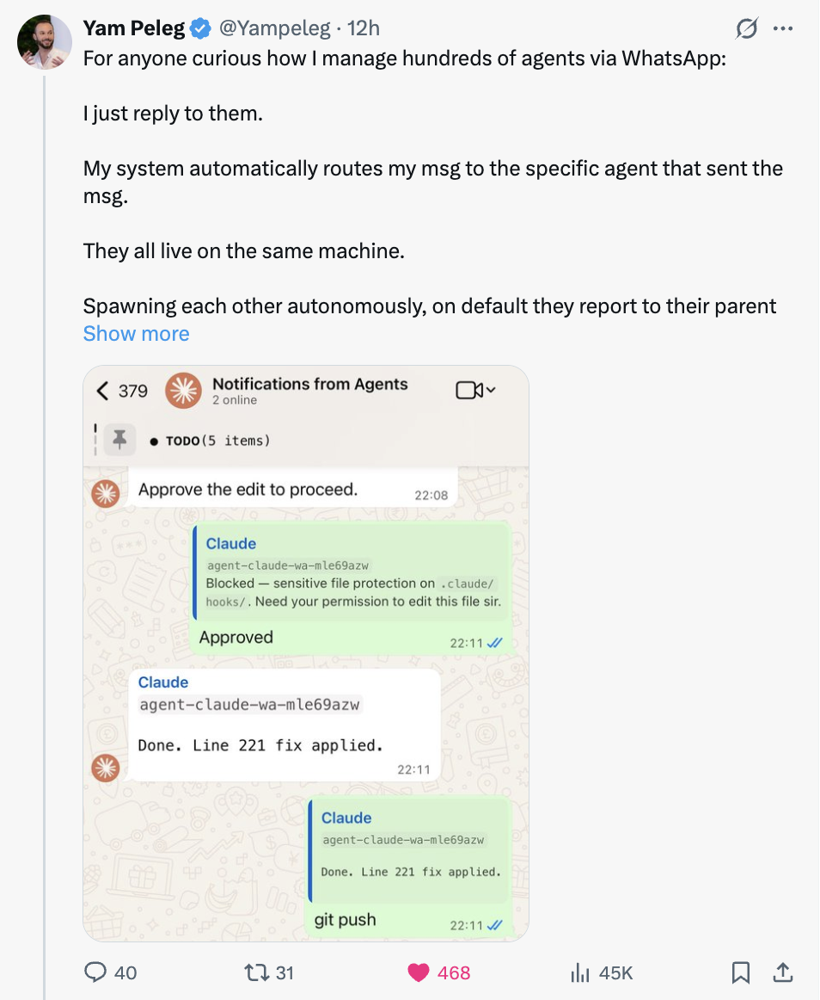

# Peleg Orchestra

A WhatsApp-based command center for orchestrating Claude Code agents. Send a message to a WhatsApp group and a Claude Code agent spawns to handle it. Reply to an agent's message and it resumes with full context. Send a voice message and it gets transcribed and processed automatically.



## Inspiration

This project is inspired by [Yam Peleg's tweet](https://x.com/Yampeleg/status/2020624600246481263) demonstrating a WhatsApp group where you command Claude Code agents via messages.

**This project was built entirely as an experiential exercise and is provided as-is. It is not coordinated with, endorsed by, or affiliated with Yam Peleg in any way. Yam Peleg bears no responsibility for this project or its use. Use entirely at your own risk.**

## How It Works

```
WhatsApp Group
      ↕  (notification queue via Green API)
  orchestra.ts
      ↕
  ┌───┴────┐
  │ Router │
  └───┬────┘
      ├── Reply?  → find agent by quoted message → resume session
      ├── Voice?  → download → transcribe → process as text
      └── New?    → spawn new Claude Code agent
```

1. **New message** → 👀 reaction → spawns a new `claude -p` agent → ⚡ reaction while working → responds in group
2. **Reply to agent** → resumes that agent's session via `claude -p --resume`
3. **Voice message** → downloaded, transcribed via ElevenLabs Scribe, then processed as text
4. **Agent output** → sent back to the WhatsApp group, tagged with the agent ID
5. **Reply routing** → each sent message ID is tracked, so replies route back to the correct agent

## Prerequisites

- [Node.js](https://nodejs.org/) (v18+)
- [Claude Code CLI](https://docs.anthropic.com/en/docs/claude-code) installed globally
- A [Green API](https://green-api.com/) account with an active WhatsApp instance
- (Optional) An [ElevenLabs](https://elevenlabs.io/) API key for voice transcription

## Installation

You can ask your Claude Code agent to set this up for you:

> "Clone peleg-orchestra repo, create the .env from .env.example, fill in my Green API credentials, create a WhatsApp group, and start the orchestrator"

Or manually:

```bash
git clone https://github.com/YOUR_USERNAME/peleg-orchestra.git
cd peleg-orchestra
npm install
cp .env.example .env
# Edit .env with your credentials
npm start
```

### Setting up Green API

1. Sign up at [green-api.com](https://green-api.com/)
2. Create a new instance and link your WhatsApp
3. Copy the instance ID and API token to your `.env`
4. Create a WhatsApp group (or use the Green API `createGroup` endpoint)
5. Set the group ID in `WA_GROUP_ID`

### Setting up ElevenLabs (optional, for voice)

1. Sign up at [elevenlabs.io](https://elevenlabs.io/)
2. Get your API key from the dashboard
3. Set it in `ELEVENLABS_API_KEY`

## Usage

```bash
npm start
```

Then send messages to your WhatsApp group:

- **Text message** → a new agent spawns and responds
- **Reply to an agent's message** → the same agent continues the conversation
- **Voice message** → gets transcribed, then an agent processes it

## Project Structure

```
peleg-orchestra/
├── orchestra.ts           # Main orchestrator (polling, routing, spawning)
├── system-prompt.md       # System prompt template injected into each agent
├── .env.example           # Environment variable template
├── package.json
├── agents/
│   └── registry.json      # Agent state (session IDs, message IDs, status)
├── tools/
│   └── registry.json      # Shared tools built by agents
└── logs/                  # Per-agent output logs
```

## Configuration

| Variable | Description | Required |
|----------|-------------|----------|
| `GREEN_API_URL` | Green API base URL | Yes |
| `GREEN_API_MEDIA_URL` | Green API media URL | Yes |
| `GREEN_API_INSTANCE` | Green API instance ID | Yes |
| `GREEN_API_TOKEN` | Green API token | Yes |
| `WA_GROUP_ID` | WhatsApp group ID (`...@g.us`) | Yes |
| `ELEVENLABS_API_KEY` | ElevenLabs API key | No (voice only) |
| `POLL_INTERVAL` | Polling interval in ms (default: 3000) | No |
| `MAX_AGENT_TURNS` | Max agent turns per run (default: 25) | No |

## Disclaimer

This software is provided "as is", without warranty of any kind. Use at your own risk. The authors are not responsible for any consequences of using this software, including but not limited to API costs, unintended actions by agents, or WhatsApp account restrictions.

Agents run with `bypassPermissions` mode, meaning they have full system access. Only run this on machines where you are comfortable granting that level of access.

## License

MIT
